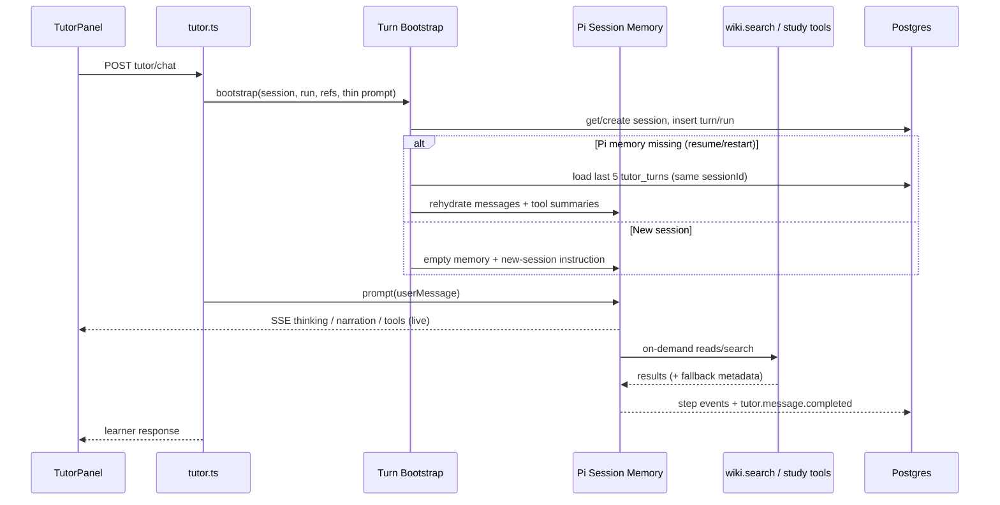

# Tutor Runtime Bootstrap and Observability — Implementation Plan

Date: 2026-06-06

Status: Approved design (from grill-with-docs session)

This plan implements the amended ADR-0018 and ADR-0019 decisions: minimal Turn Bootstrap, on-demand `wiki.search` retrieval, full Runtime Work View observability, Pi Session Memory with rehydration, and complete removal of Tutor Host Context Snapshot cache.

## Decision summary

| Topic                 | Decision                                                                       |
| --------------------- | ------------------------------------------------------------------------------ |
| Corpus retrieval      | On-demand via `wiki.search` only; no turn-prep retrieval or embeddings         |
| Turn prep             | **Turn Bootstrap** — session, run, refs, thin prompt; tools for notebook facts |
| Host context cache    | **Remove completely** (`tutor_turn.host_context_snapshot`)                     |
| Pi thinking           | Model-capability aware `thinkingLevel`; learner-visible thinking stream        |
| Runtime Work View     | Thinking → narration → tool steps → learner response (chronological)           |
| Narration vs response | Last assistant message wins; tool-only turns allowed (no chat bubble)          |
| `tutor.message.delta` | Remove from durable events and trace spans; keep live SSE for streaming        |
| Durable observability | Step events + one `durable_event.summary` trace per turn                       |
| Embedding failures    | Annotated lexical fallback in `wiki.search` (`fallbackReason`)                 |
| `strict_source_scope` | **Removed**; `soft_source_scope` only                                          |
| Pi session disposal   | Binding-only (refs, mode, prompt, session, notebook, user)                     |
| Rehydration           | Same `sessionId`, ≤5 turns, dialogue + tool summaries                          |
| New session           | No cross-session rehydrate; explicit new-session bootstrap instruction         |
| Mastery `contextRefs` | From `wiki.search` / tool outputs in `toolSummary`, not turn-prep chunks       |

## Architecture (target)

---

## Phase 1 — Turn Bootstrap refactor (API)

**Goal:** Replace fat `prepareTutorTurn()` with minimal bootstrap; delete host context cache and turn-prep retrieval.

### 1.1 Rename and slim `tutor-turn-preparation.ts`

- [x] Rename exported flow to `bootstrapTutorTurn()` (keep file or split into `tutor-turn-bootstrap.ts`).
- [x] **Remove:** `loadTutorHostContextSnapshot`, `resolveTutorHostContextCacheVersion`, all `TUTOR_HOST_CONTEXT_CACHE_*` code.
- [x] **Remove:** `selectContextForTutor` call, `context.retrieval` span, `session.context.selected` / `session.context.selection_failed` at prep.
- [x] **Remove:** `mergeSelectedNodeRefs` enrichment from retrieval chunks (user-selected refs only).
- [x] **Remove:** intent routing that depends on preloaded study state OR reimplement via thin optional hints only.
- [x] **Keep:** `getOrCreateTutorSession`, `filterSelectedNodeRefsForNotebook`, `createRuntimeRun`, tool registry creation, correlation context.
- [x] **Add:** `buildThinPromptContext()` — notebook title/id, mode, selected refs, open artifact ref if selected (light DB read ok).
- [x] **Add:** `isNewSession` flag → append one-time `[New session]` instruction: re-read plan via tools; prior session chat not in context.
- [x] Update `apps/api/src/routes/tutor.ts`: span `tutor.turn.bootstrap` (replace `tutor.turn.prepare`).

### 1.2 Remove host context cache invalidation

- [x] `apps/api/src/agentic-cache-invalidation.ts`: remove `hostContextSnapshot: "tutor_turn.host_context_snapshot"` namespace and invalidation rules for it.
- [x] Delete or migrate tests in `agentic-cache-invalidation.test.ts` that assert host-context invalidation.
- [x] Optional: one-time migration/script to delete stale `tutor_turn.host_context_snapshot` rows from `agentic_cache_entries`.

### 1.3 Remove / relocate `selectContextForTutor`

- [x] Keep hybrid search path inside `wikiSearch` provider method only.
- [x] Delete `selectContextForTutor` export if nothing else needs it, or move to `wiki-search-internal.ts`.
- [x] Remove `maybeRefineTutorContextPlan` from turn prep (keep inside `wiki.search` if still valuable).
- [x] Delete `tutor-context-selection-cache.test.ts` or rewrite as `wiki.search` cache tests.
- [x] Update `tutor-context-selection.test.ts` — keep unit tests for scoped row helpers only if `wiki.search` still uses them.

### 1.4 Remove `strict_source_scope`

- [x] `packages/schemas/src/learning-levels.ts`: `sourceScopePolicySchema` → `soft_source_scope` only (or deprecate field).
- [x] `packages/agent-runtime/src/index.ts`: remove `strict_source_scope` from `StudyAgentPromptContext`.
- [x] `apps/api/src/routes/tutor.ts`: stop accepting/parsing strict scope.
- [x] `apps/web`: remove strict scope UI if present.
- [x] Remove `sourceCoverageGap`, `resolveScopedRetrievalRows` strict branch, `gap_strict_source_scope` mastery sentinel.
- [x] Update mastery/regression tests.

### 1.5 Thin `hostStateSignature`

- [x] `packages/agent-runtime/src/host-state-signature.ts` (or equivalent): signature from binding inputs only — mode, refs fingerprint, prompt fingerprint, notebook/user/session ids.
- [x] **Exclude** study plan summaries, weak concepts, chunk ids from signature.
- [x] Verify `replaceStudyAgentTutorRuntime` disposes only on binding change.

**Tests:** `tutor-turn-preparation.test.ts`, `tutor-turn-host-state.integration.test.ts`, `tutor-chat.routes.test.ts`, `host-state-signature.test.ts`.

---

## Phase 2 — Pi runtime: thinking, narration, message.delta

**Goal:** Map full Pi SDK event surface; enable thinking; split narration/response; stop durable deltas.

### 2.1 Pi SDK event mapping (`packages/agent-runtime`)

- [x] Extend `handlePiSdkEvent` for `thinking_start`, `thinking_delta`, `thinking_end`.
- [x] Emit new `PiAgentSessionEvent` types: `thinking_delta`, `thinking_complete`, etc.
- [x] Implement **last-assistant-message-wins** in agent loop observation:
  - Non-final assistant `message_complete` → `narration_complete` event.
  - Final assistant `message_complete` → `message_complete` (learner response).
- [x] Enable `thinkingLevel` from model capability probe (`pi-ai` / model registry); default off when unsupported.

### 2.2 Remove durable `tutor.message.delta`

- [x] `pi-event-mapper.ts`: return `null` for `message_delta` (no append input).
- [x] `packages/schemas/src/events.ts`: mark `tutor.message.delta` deprecated or remove from allowed append types for new runs.
- [x] `tutor-turn.ts`: do not call `appendEvent` for deltas (already via mapper).
- [x] Keep streaming: `ag-ui.ts` still maps deltas to `TEXT_MESSAGE_CONTENT` for live learner response stream.

### 2.3 New durable step events

- [x] Add event types to `packages/schemas/src/events.ts`:
  - `agent.thinking.completed`
  - `agent.narration.completed`
- [x] Map from Pi session events in `pi-event-mapper.ts` with bounded payloads (text summary, durationMs).
- [x] Append on step completion during `executeTutorTurn`.

### 2.4 AG-UI / SSE extensions

- [x] Add SSE event types for Runtime Work View:
  - `THINKING_START` / `THINKING_CONTENT` / `THINKING_END`
  - `RUNTIME_NARRATION_START` / `RUNTIME_NARRATION_CONTENT` / `RUNTIME_NARRATION_END`
  - (Tool events largely exist as `TOOL_CALL_*`)
- [x] Update `packages/agent-runtime/src/ag-ui.ts` mappers.

**Tests:** `pi-event-mapper.test.ts`, `pi-session.test.ts`, `ag-ui` tests, `tutor-turn.test.ts`.

---

## Phase 3 — Pi Session Memory and rehydration

**Goal:** Conversation continuity without host context cache.

### 3.1 Rehydration module

- [x] New `apps/api/src/pi-session-rehydration.ts`:
  - `loadRehydrationTranscript(db, sessionId, limit=5)`
  - Returns user text, assistant text (if any), compact tool summaries per turn.
- [x] Call before `createAgentSession` when `livePiSessions` miss for `sessionId`.
- [x] **Never** rehydrate across session IDs.

### 3.2 Wire into `pi-tutor-runner.ts`

- [x] Accept optional `initialMessages` or rehydration hook on session create.
- [x] Seed Pi `session.messages` from rehydration payload.
- [x] Env: `TUTOR_REHYDRATE_TURN_LIMIT` (default 5).

### 3.3 New session detection

- [x] `getOrCreateTutorSession` returns `{ session, created: boolean }` or detect empty turns.
- [x] Pass `created` to bootstrap for new-session instruction.

### 3.4 Pause / resume

- [x] `resumeTutorSessionLifecycle` triggers rehydration on next chat after dispose.
- [x] Document that pause disposes Pi memory by design.

**Tests:** new `pi-session-rehydration.test.ts`, `tutor-session-lifecycle.test.ts`, integration test for resume after restart.

---

## Phase 4 — `wiki.search` retrieval and embedding observability

**Goal:** Annotated fallback; embeddings only on search.

### 4.1 `runSearchWithLexicalFallback`

- [x] Return `{ rows, retrievalMode, fallbackReason? }` instead of silent fallback.
- [x] Catch paths: timeout, HTTP error, missing API key, dimension mismatch.
- [x] Log structured warning + metric `search_retrieval_fallback_total{reason}` (bounded labels).

### 4.2 `wikiSearch` tool output schema

- [x] Extend `wikiSearchResponsePayloadSchema` with optional `retrievalMode`, `fallbackReason`.
- [x] Include chunk/source refs in results for mastery `contextRefs` extraction.

### 4.3 OpenRouter embeddings span

- [x] Ensure `openrouter.embeddings` ERROR `statusMessage` propagates to parent `tool.call` output summary.

**Tests:** `tutor-tool-provider` search tests, `openrouter-embeddings` tests, route search tests.

---

## Phase 5 — Observability seam

**Goal:** Batched durable trace; Runtime Work View in UI; developer timeline replay.

### 5.1 `@studyagent/observability`

- [x] Replace `tutor.turn.prepare` → `tutor.turn.bootstrap` in `AgentObservationName`.
- [x] Remove `host_context.load`, `context.retrieval`.
- [x] Add `durable_event.summary`.
- [x] Implement `DurableEventSummaryCollector` in tutor turn: record `{ eventType, outcome }` per append; flush one span at turn end.
- [x] Remove per-row `startAgenticObservation("durable_event.append")` from hot path (keep metrics in `recordDurableEventMetric`).

### 5.2 Developer timeline

- [x] `developer-timeline.ts`: map `agent.thinking.completed`, `agent.narration.completed` into trace replay.
- [x] Remove reliance on `tutor.message.delta` for thinking inference.
- [x] `isThinkingEvent` / activity classification updates.

### 5.3 Metrics

- [x] Remove `tutor_turn.host_context_snapshot` from cache metrics dashboards/tests.
- [x] Add fallback metric for search if not present.

**Tests:** `langfuse.test.ts`, `metrics.test.ts`, `developer-timeline` / `AgentTrace.test.ts`.

---

## Phase 6 — Web workspace UI

**Goal:** Cursor-style Runtime Work View for learners.

### 6.1 `TutorPanel.tsx`

- [x] Render chronological work blocks between user message and learner bubble:
  1. Collapsible thinking (`THINKING_*` SSE)
  2. Narration lines (`RUNTIME_NARRATION_*`)
  3. Tool activity timeline (`TOOL_CALL_*`, friendly labels)
  4. Learner response (existing message stream)
- [x] Tool-only turn: show work view, no empty assistant bubble.
- [x] Remove regex-based “Tutor reasoning” hack from `AgentTrace.tsx` where SSE replaces it.

### 6.2 `AgentTrace.tsx`

- [x] Consume step events for completed-turn replay.
- [x] `buildReasoningActivities` from `agent.thinking.completed` / `agent.narration.completed`.
- [x] Dev Mode: raw payloads unchanged.

### 6.3 SSE client

- [x] `updateLiveTraceRun` handlers for new event types.
- [x] Separate live work view state from final chat history.

**Tests:** `AgentTrace.test.ts`, `TutorPanel.test.ts`, `app-event-contract.test.ts`.

---

## Phase 7 — Mastery and turn completion

**Goal:** Mastery works without turn-prep `contextSelection`.

### 7.1 `contextRefs` from tools

- [x] `extractContextRefsFromToolSummary(toolSummary)` — chunk/source ids from `wiki.search` results.
- [x] `buildMasteryRuntimeContextPatch` / `loadLatestPendingMasteryEvaluationFallback`: use tool-derived refs.
- [x] Remove `session.context.selected` append and `toolSummaryJson.contextSelection` block (or keep empty for migration).

### 7.2 Runtime auto-evaluation

- [x] `prepareRuntimeMasteryEvaluation` at turn start: drop `contextSelection` input; use pending snapshot only.
- [x] Tool-only assistant turn: no pending evaluation (unchanged).

**Tests:** `mastery-session.test.ts`, `mastery-tutoring-regression.test.ts`, `tutor-turn.test.ts`.

---

## Phase 8 — Evals and regression

- [x] `packages/eval-runner`: remove `contextSelection` assertion requirement or replace with `wiki.search` tool-call assertion.
- [x] `synthetic-learner-evals`: update observation filters (no delta dependency).
- [x] `regression-scenarios.test.ts`: remove context-selection reasoning scenarios; add work-view step assertions if applicable.

---

## Phase 9 — Documentation sweep (this change set)

- [x] Amend ADR-0018
- [x] Amend ADR-0019
- [x] Update `docs/contexts/api-runtime/CONTEXT.md`
- [x] Update `docs/contexts/web-workspace/CONTEXT.md` (Runtime Work View, rehydration)
- [x] Update `docs/adr/0003-curriculum-first-tutor-behavior.md` current implementation
- [x] Update `docs/architecture/product-alignment-and-mastery-evaluator-implementation-tickets.md` strict scope ticket as superseded

---

## File change checklist (code)

| Area               | Primary files                                                                    |
| ------------------ | -------------------------------------------------------------------------------- |
| Bootstrap          | `tutor-turn-preparation.ts`, `routes/tutor.ts`                                   |
| Host cache removal | `tutor-turn-preparation.ts`, `agentic-cache-invalidation.ts`                     |
| Retrieval          | `tutor-tool-provider.ts`                                                         |
| Pi runtime         | `pi-tutor-runner.ts`, `pi-event-mapper.ts`, `ag-ui.ts`, `host-state-signature*`  |
| Rehydration        | new `pi-session-rehydration.ts`, `pi-session-cache.ts`                           |
| Observability      | `observability/src/index.ts`, `tutor-turn.ts`, `agentic-cache-invalidation.ts`   |
| Schemas            | `schemas/events.ts`, `schemas/learning-levels.ts`, `schemas/api.ts` (chat trace) |
| Mastery            | `mastery-session.ts`, `tutor-turn.ts`                                            |
| Web                | `TutorPanel.tsx`, `AgentTrace.tsx`                                               |
| Tests              | all files listed in phases                                                       |

---

## Rollout order (recommended)

1. **Phase 1 + 4.1** — Stop turn-prep retrieval/embeddings; annotated wiki.search fallback (immediate cost/latency win).
2. **Phase 2 + 5** — Thinking events, no delta durable, step events, summary trace.
3. **Phase 3** — Rehydration + binding-only disposal.
4. **Phase 6** — Learner-facing Runtime Work View.
5. **Phase 7–8** — Mastery + eval alignment.
6. **Phase 1 host cache deletion** — Remove dead code paths and DB namespace cleanup.

---

## Risks and mitigations

| Risk                                      | Mitigation                                                                  |
| ----------------------------------------- | --------------------------------------------------------------------------- |
| First turn slower (tool reads)            | System prompt instructs minimal tool sequence; optional parallel tool calls |
| Pi session stale notebook state           | Tools on demand; binding does not include material state                    |
| Rehydration token bloat                   | Cap 5 turns; compact tool summaries only                                    |
| Eval scenarios break                      | Phase 8 explicit migration                                                  |
| Missing learner bubble on tool-only turns | Documented; UI shows work view status                                       |

---

## Follow-ups completed (2026-06-06)

- [x] Migration `0013_cleanup_host_context_snapshot_cache.sql` deletes stale `tutor_turn.host_context_snapshot` rows.
- [x] CLI `pnpm --filter @studyagent/api cache:cleanup-stale-host-context` (`--dry-run` supported) via `deleteAgenticCacheByNamespace`.
- [x] `wiki.search` uses cached `loadTutorRetrievalRows`; tests moved to `wiki-search-cache.test.ts`.
- [x] Removed dead `selectContextForTutor` turn-prep path and `tutor_turn.retrieval_plan` cache namespace.
- [x] Tutor chat route smoke test asserts `THINKING_*` / `RUNTIME_NARRATION_*` SSE and no `tutor.message.delta` durable append.

## Out of scope (later)

- Persisted cross-process Pi session store (Redis); in-process only for now.
- `studyPlan.activeSessionId` wiring (explicitly not chosen).
- Renaming `wiki.search` to `notebook.search` (optional later).
