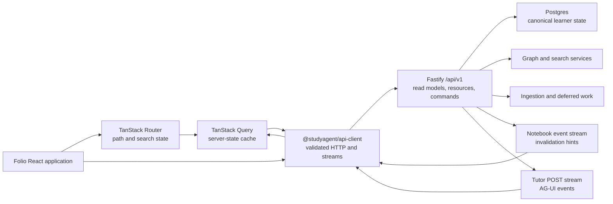

# Folio Production Frontend Architecture

Status: approved foundation; implementation pending

Date: 2026-06-27

Decision record: [ADR-0029](../adr/0029-react-vite-tanstack-fastify-folio-foundation.md)

Visual baseline: [Folio Design Kit](./13-folio-design-kit.md) and the runnable [Folio Design Lab](../../frontend-examples/folio/design-lab/README.md)

Behavioral contracts: numbered frontend docs `00` through `12`, ADR-0027, and ADR-0028

## 1. Outcome

The target is one production Folio frontend backed entirely by real StudyAgent data and behavior. It replaces the current frontend implementation instead of wrapping or preserving it. The finished system must:

- cover every public, learner, Notebook Workspace, Admin, Eval, loading, empty, error, degraded, and responsive route state;
- render the approved Folio visual language without a Legacy/Mist runtime path;
- use persisted product state and API-owned read models rather than Design Lab sample data or browser-side joins;
- preserve auth, entitlement, Beta Consent, tutor, graph, Evidence, Artifact, ingestion, mastery, Interactive Learning, MCP App, and account behavior at the contract/outcome boundary;
- make Dashboard-to-Workspace actions reloadable, shareable, and deterministic;
- meet the WCAG 2.2 AA target and the responsive contract in [10-responsive-accessibility-states](./10-responsive-accessibility-states.md);
- remain observable, testable against the real Docker-backed system, and small enough to load as a route-split application.

The current components are evidence, not assets that must survive. Reuse is permitted only when it lowers risk and the reused behavior is covered by tests.

## 2. Current-State Evidence

The 2026-06-27 audit found:

| Signal                  | Current state                                                                           | Production implication                                                                          |
| ----------------------- | --------------------------------------------------------------------------------------- | ----------------------------------------------------------------------------------------------- |
| Web TypeScript/TSX      | 109 files, about 20,321 lines                                                           | A clean replacement still needs deliberate capability inventory and deletion gates              |
| Route matching          | 31 pathname matches in a handwritten router                                             | Search state, nested layouts, pending/error boundaries, and route splitting are not first-class |
| HTTP access             | 29 direct `fetch` calls across 12 files                                                 | Auth headers, error handling, validation, cancellation, and invalidation drift                  |
| TanStack Query          | Used across 24 files                                                                    | Correct server-state foundation exists, but query definitions are not centralized               |
| Tutor transport         | TanStack AI appears in one file                                                         | The dependency can be isolated or replaced without affecting the rest of the app                |
| Largest modules         | `AgentTrace` 2,412 lines; `TutorPanel` 1,917; `FullPanelViewer` 1,216; `Whiteboard` 869 | Transport, orchestration, state, and presentation need feature boundaries                       |
| Browser dependency leak | `@studyagent/eval-runner` has no web imports                                            | Remove it from the web runtime dependency graph                                                 |
| Production build        | One 1,704.89 kB minified JS chunk, 499.46 kB gzip                                       | Route splitting and conditional heavy-feature loading are release requirements                  |
| CSS build               | 203.34 kB, 46.07 kB gzip                                                                | Legacy/theme CSS and unused font/theme assets must be removed                                   |
| Fonts                   | Multiple full families and scripts emitted                                              | Folio must load only Newsreader, Inter, and JetBrains Mono subsets actually used                |
| Web test command        | No package-local `test` script                                                          | Web unit/component tests must become a named package and CI gate                                |
| Browser coverage        | One hosted-beta Chromium suite                                                          | Complete real-data route, Workspace, accessibility, and visual coverage is missing              |

Existing strengths remain part of the target:

- Fastify REST and SSE already serve auth, learner, Workspace, Admin, and Eval routes;
- shared Zod schemas cover important graph, Reference Surface, Interactive Learning, NodeRef, event, and learner-state contracts;
- TanStack Query is already in production use;
- notebook events already map durable changes to targeted Query invalidation;
- React Flow already backs the real graph;
- the nginx deployment already serves a static Vite build and proxies `/api/*` and `/auth/*` same-origin;
- Interactive Learning contracts, action dispatch, MCP App bridge, bundle registry, and tests already exist and should be ported rather than re-designed from mock Folio markup.

## 3. System Shape



The browser never treats an event stream, iframe, local storage, analytics platform, or LLM response as canonical product state. Those channels may prompt a refetch or carry live presentation events; Postgres-backed API reads remain authoritative.

## 4. Package Responsibilities

### `apps/web`

Owns:

- file-based routes and layout boundaries;
- Folio product composites and responsive composition;
- feature controllers for Tutor, Study Map, Reference, Evidence, Practice, Interactive Learning, dashboard, and operator surfaces;
- Query consumption and mutation orchestration;
- URL codecs for Dashboard Action Targets and Workspace state;
- semantic Study Activity Pulse emission;
- browser-only integrations such as focus, visibility, local split preference, and accessible interaction.

Does not own:

- raw API response types duplicated from the server;
- cross-resource joins or recommendation ranking;
- durable study state;
- ad hoc request wrappers inside components;
- graph, mastery, Artifact, Evidence, or session business rules.

### `packages/ui`

Owns:

- Folio semantic design tokens;
- Newsreader/Inter/JetBrains typography roles;
- Tailwind preset and global base styles;
- accessible primitives and low-domain composites shared by learner and operator routes;
- focus, elevation, border, status, loading, empty, and error treatments.

Does not own Notebook-specific API calls, Query hooks, Tutor behavior, graph nodes tied to API types, or route composition.

Exports should remain explicit. Avoid importing a large barrel from route entry points when direct component exports allow the bundler to produce smaller chunks.

### `packages/schemas`

Owns runtime-safe contracts shared across API, client, event streams, MCP App bridge, and tests:

- route params, query, body, success response, and stable error envelopes;
- `NodeRef`, Dashboard Action Target, Learner Dashboard Summary, Workspace Bootstrap;
- Tutor stream events and Tutor Turn Disposition;
- Study Activity Pulse/Interval views;
- Reference Surface, Evidence, Artifact, Practice, Interactive Learning, and refresh hints.

Schemas describe product data, not CSS classes, component names, pixels, or Tailwind tokens.

### `packages/api-client`

New browser-compatible package. Owns:

- native-fetch request execution;
- session/dev identity headers and same-origin credentials;
- runtime response parsing;
- stable `ApiError` construction;
- abort and correlation handling;
- query option/key factories;
- command helpers with idempotency keys;
- Tutor and notebook-event stream adapters.

It must not import React. Thin React Query hooks, when useful, remain in `apps/web` feature modules so the client can also be used by tests or future non-React consumers.

### `apps/api`

Owns authenticated Fastify routes, request validation, learner-safe projection, pagination, read-model joins, commands, event emission, and stream responses. It uses shared schemas and returns no visual implementation details.

### Persistence and domain packages

`@studyagent/db`, graph, search, tools, runtime, wiki, worker, and other domain packages remain behind the API. The frontend does not import them.

## 5. Proposed Web Structure

```text
apps/web/src/
  app/
    providers/
    query-client.ts
    router.tsx
    monitoring.ts
  routes/
    __root.tsx
    _public.tsx
    _public.index.tsx
    _public.demo.tsx
    _public.contact.tsx
    _public.privacy.tsx
    _public.terms.tsx
    login.tsx
    auth.callback.tsx
    _learner.tsx
    _learner.app.index.tsx
    _learner.app.consent.tsx
    _learner.app.templates.$templateId.tsx
    _learner.app.workspaces.new.tsx
    _learner.app.credits.tsx
    _learner.app.access-code.tsx
    _learner.app.support.tsx
    _learner.app.account.tsx
    _learner.notebooks.$notebookId.tsx
    _admin.tsx
    _admin.admin.*.tsx
    _admin.eval-runs.*.tsx
  features/
    auth/
    dashboard/
    workspace/
    tutor/
    study-map/
    reference/
    evidence/
    practice/
    interactive-learning/
    sources/
    account/
    admin/
    eval/
  components/
    folio/
  styles/
    app.css
```

The exact file names may vary, but the boundaries may not collapse back into page-scale components that own transport, all state, and all rendering.

## 6. Route Architecture

### Layout boundaries

| Boundary           | Responsibility                                                                                      |
| ------------------ | --------------------------------------------------------------------------------------------------- |
| Root               | Query provider, router outlet, global Folio base, not-found boundary, fatal error recovery          |
| Public             | Public header/footer and anonymous analytics policy; never loads learner-only bundles               |
| Learner            | Session query, disabled-account handling, Study Access, Beta Consent redirects, consented analytics |
| Notebook Workspace | Notebook ownership, Workspace Bootstrap, pane layout, event sync, surface/deep-link validation      |
| Admin              | Admin Access, operator navigation, dense Folio-token-aligned layout                                 |
| Eval/Dev           | Admin Access and explicit development-mode presentation                                             |

Auth and entitlement checks run in route `beforeLoad`/loader boundaries and are repeated on the server. Client guards are navigation UX, not authorization.

### URL-owned Workspace state

The Notebook Workspace route validates search state for:

- active surface: Study Map, Reading, Interactive, App, Practice, or another approved surface;
- action intent: continue, review, practice, or resume;
- optional `NodeRef`;
- optional Artifact or Tutor Session reference;
- Evidence/source-open target when shareable;
- selected tab where back/forward semantics matter.

Temporary canvas pan/zoom, composer text, hover, transient drawer animation, and unsent quiz selection stay local. The 35/65 split preference is versioned and persisted locally per Notebook; it is not encoded into shareable URLs.

One URL codec is used by dashboard actions, tutor-created navigation, Study Map links, tests, and Workspace bootstrap. Invalid or unauthorized targets fall back to the nearest valid surface with a learner-safe message rather than breaking the route.

## 7. State Ownership

| State                                                               | Owner                            | Persistence                                        |
| ------------------------------------------------------------------- | -------------------------------- | -------------------------------------------------- |
| Session, entitlements, consent                                      | API + Query                      | Server session/database                            |
| Route and shareable Workspace selection                             | Router                           | URL                                                |
| Dashboard, Workspace Bootstrap, graph, Reference, Evidence, history | API + Query                      | Server/database                                    |
| Tutor live run assembly                                             | Tutor adapter/feature controller | Memory; durable transcript reloads from API        |
| Notebook refresh                                                    | Notebook event adapter + Query   | Last sequence in memory; canonical data refetched  |
| 35/65 split                                                         | Workspace layout controller      | Versioned local storage per Notebook               |
| Composer draft                                                      | Tutor feature                    | Local component; optional future draft persistence |
| Drawer/popover/hover state                                          | Smallest feature component       | Memory                                             |
| Practice answer before submit                                       | Practice component               | Memory                                             |
| Practice result and Mastery Evidence                                | API + Query                      | Database                                           |
| MCP App temporary UI state                                          | Sandboxed bundle                 | Memory only                                        |
| Interactive Learning canonical state                                | API                              | Database                                           |
| Study Activity Interval                                             | API                              | Database                                           |
| Study Activity heartbeat eligibility                                | Activity controller refs         | Memory                                             |
| Product analytics                                                   | PostHog mirror                   | Not canonical product state                        |

## 8. API Client Contract

Every operation has a shared contract and an operation-specific function. Components never call `fetch` directly.

### Request behavior

- prefix `/api/v1` for product routes and preserve `/auth/*` for auth routes;
- send `credentials: include`;
- attach the local development identity header only through one environment-aware policy;
- set `Content-Type` only for compatible bodies;
- accept `AbortSignal` from Query or Router;
- generate an idempotency key for commands that may be retried after an uncertain response;
- never log cookies, authorization headers, source text, learner answers, or transcript bodies.

### Success behavior

- check HTTP status;
- parse JSON or stream frames according to the operation contract;
- validate untrusted boundary data with Zod;
- capture request/trace correlation headers;
- return typed product data, not raw `Response` objects, except inside streaming adapters.

### Error behavior

Canonical error shape:

```ts
type ApiErrorPayload = {
  error: {
    code: string;
    message: string;
    requestId?: string;
    traceId?: string;
    fieldErrors?: Record<string, string[]>;
    retryable?: boolean;
  };
};
```

The browser maps stable codes to recovery behavior. Learner routes show learner-safe messages. Admin/Dev Mode may show request and trace IDs, never raw stack traces or secrets.

### Query factories

Each read exports one query option factory containing:

- canonical structured key;
- operation call;
- stale and garbage-collection policy;
- retry policy;
- optional placeholder/selection transform;
- invalidation tags or helpers.

Routes prefetch with the same factory that components consume. This prevents loader/component double-fetch and key drift.

## 9. API Surface For Folio

The list distinguishes existing capabilities from required projections. Exact schemas live in `@studyagent/schemas`.

### Bounded read models

| Read model                       | Route                                            | Purpose                                                                                                                        |
| -------------------------------- | ------------------------------------------------ | ------------------------------------------------------------------------------------------------------------------------------ |
| Learner Dashboard Summary        | `GET /api/v1/dashboard`                          | Notebook progress, resume actions, due Practice, Dashboard Recommendations, recent activity, Study time                        |
| Notebook Workspace Bootstrap     | `GET /api/v1/notebooks/:notebookId/workspace`    | Notebook header, source readiness summary, available surfaces, current study/session summary, initial action target validation |
| Account Resource Summary         | `GET /api/v1/account/resources`                  | Workspaces and sources for account management without per-workspace N+1 reads                                                  |
| Admin overview/table projections | Existing `/admin/*` routes, normalized as needed | Operator-specific tables and details, independently paginated                                                                  |

Workspace Bootstrap must remain bounded. It does not embed the full graph, Reference Surface, Evidence body, source file, Tutor transcript, or all artifacts.

### Independently cacheable resources

- Notebook sources and ingestion status;
- Study State and Workspace Read Model/graph query;
- Curriculum outline;
- Reference Surface by `NodeRef` or Artifact;
- Evidence and source-open target;
- paginated Tutor Session list and Session detail;
- artifacts and attempts;
- Eval/Admin resources.

### Commands

- Beta Consent and onboarding;
- Personal Learner Workspace creation from Published Study Template;
- source upload/retry/delete;
- tutor chat and Tutor Session pause/resume/end;
- Artifact approve/reject/edit/regenerate;
- Practice submission and next-item actions;
- Interactive Learning Action dispatch;
- Study Activity Pulse;
- Dashboard Recommendation refresh;
- credit checkout and Access Code redemption;
- Learning Feedback, Support Report, and account deletion.

### Read-model principles

- Project learner-safe labels and action targets on the server.
- Join persisted data once on the server instead of requesting per Notebook from the browser.
- Return explicit unavailable/not-ready states when data does not exist.
- Use cursor pagination for Tutor history, activity, Evidence groups, Admin tables, and Eval history where growth is unbounded.
- Do not return UI tokens, component names, Tailwind classes, or presentation dimensions.
- Do not invoke an LLM from a GET route.

## 10. Learner Dashboard Summary

The dashboard response is one versioned projection with independently renderable sections:

- learner/header summary and freshness;
- Personal Learner Workspace summaries with current Curriculum/Module, progress, last activity, readiness, and typed resume action;
- due Practice items backed by persisted Artifacts, review state, quiz attempts, and `nextReviewAt`;
- Dashboard Recommendations with deterministic reason, ordering, typed action, and optional persisted LLM enrichment state;
- recent learner-safe activity;
- weekly/monthly Study Activity aggregates with timezone boundaries and unavailable state.

Section-level `status` values let Folio render partial success honestly. One unavailable recommendation enrichment must not fail Notebook summaries.

Cache semantics:

- private, learner-scoped;
- short Query staleness with event/command invalidation;
- no shared CDN caching;
- ETag/version support is optional after the first correct implementation.

## 11. Notebook Workspace Bootstrap

The bootstrap response answers only what the shell requires before child resources load:

- Notebook identity and learner-safe title;
- ownership/workspace type and template relationship;
- source count and readiness summary;
- current Curriculum/Objective/Session summary when present;
- allowed surfaces and entitlement-sensitive actions;
- whether Tutor, Study Map, Reference, Practice, Interactive, and App surfaces have enough state to open;
- normalized initial Dashboard Action Target and fallback reason;
- activity/session liveness policy inputs.

After bootstrap, independent child queries load in parallel. The route should not wait for graph, history, Evidence, and artifacts serially.

## 12. Tutor Streaming

Tutor chat is a POST stream, separate from ordinary Query reads.

The StudyAgent-owned Tutor adapter must expose:

- `send`, `steer`, `cancel`, `retry`, and `clearLiveRun` operations;
- typed message/run/session state;
- `AbortController` cancellation;
- validated AG-UI and StudyAgent custom events;
- session/run/turn/request/trace identity;
- deterministic terminal states: completed, failed, cancelled, disconnected;
- reload from durable Tutor Session history;
- learner-safe errors and Dev Mode diagnostics;
- no dependency-specific message types in Folio components.

The current TanStack AI integration uses `any` for custom events and couples message assembly to a page-scale component. The implementation slice must run a real transport proof:

1. upgrade/wrap current TanStack AI behind the adapter;
2. validate custom events without casts;
3. verify cancellation, retry, Artifact events, Runtime Work View, session identity, and durable reload;
4. measure the route chunk;
5. keep the library only if it removes more protocol complexity than it introduces.

TanStack AI's current beta documents SSE and custom connection adapters, so retaining it behind the seam is the default recommendation, not an unconditional dependency. See [connection adapters](https://tanstack.com/ai/latest/docs/chat/connection-adapters).

## 13. Notebook Event Synchronization

Keep the existing durable notebook event stream and refresh policy. Move both behind the API client/Workspace controller.

Requirements:

- resume from the last observed sequence when supported;
- ignore duplicate/out-of-order sequence values;
- parse refresh hints with shared schemas;
- map events to canonical Query factories rather than handwritten string keys;
- invalidate only affected resources;
- expose connection status in Dev Mode, not as learner alarm unless data is stale or an action failed;
- refetch authoritative state after reconnection;
- close streams on Notebook change, logout, or route unmount.

Events may launch a Workspace surface through a typed target, but they do not directly mutate Query cache with unvalidated domain payloads.

## 14. Study Activity And Session Liveness

ADR-0028 is part of the Folio architecture, not dashboard-only analytics.

One top-level Workspace Activity Controller receives semantic actions from feature adapters:

- Tutor send/completion/continue;
- surface change;
- Study Map node open;
- Reference Surface or Evidence open;
- source navigation;
- Practice submission/rating/next;
- Interactive Learning submission;
- MCP App meaningful action.

It sends content-free, idempotent pulses and sparse heartbeats only while the document is visible and recent meaningful activity makes a heartbeat eligible. Pointer movement, scroll noise, an open hidden tab, and unread tutor output do not count.

Session Liveness consumes persisted Tutor Turn Disposition. It prompts after 15 inactive minutes for an informational turn and 30 minutes while awaiting a learner answer or interactive task. Continue resumes; Pause or no response pauses. Study time remains capped by the shorter activity boundary and is never inferred from session-open duration.

Frequent timestamps and timers live in refs/services to avoid rendering the full Workspace on every pulse.

## 15. Folio Component Architecture

### Layer 1: tokens and primitives

`@studyagent/ui` contains semantic variables and accessible primitives:

- canvas, paper, panel, inset, border, text, muted, sage, amber, danger, focus;
- Newsreader display/reading, Inter UI, JetBrains Mono metadata roles;
- buttons, fields, dialog/sheet, tabs, menu, tooltip, progress, status, skeleton, separator, scroll area;
- focus ring, reduced motion, selected/current/completed/locked state conventions.

### Layer 2: product-neutral Folio composites

Examples: editorial page header, metadata row, section rule, empty state, error notice, status badge, split pane, dense operator table shell. These may live in `@studyagent/ui` only when multiple product features use the same behavior.

### Layer 3: feature components

Tutor transcript, Runtime Work View, Study Map node, Reference block, Evidence group, Practice item, Artifact card, Dashboard Notebook row, and MCP App host remain in `apps/web/features/*` because they depend on StudyAgent contracts.

### Layer 4: routes

Routes compose feature entry points, own loader/error boundaries, and contain little domain or rendering logic.

No component layer may import the old theme switcher or Legacy/Mist styles. There is no generic fallback design: every required state receives Folio presentation.

## 16. Responsive Composition

Desktop Notebook Workspace:

- 35% Tutor / 65% Workspace default;
- keyboard- and pointer-draggable divider;
- persisted per-Notebook preference with safe min/max bounds;
- independent pane scrolling;
- composer remains attached to the Tutor pane;
- Evidence uses an accessible sheet/drawer without destroying either pane's scroll position.

Tablet:

- vertical or mode-switched composition as defined during the Workspace slice;
- divider changes orientation only where both panes remain simultaneously useful;
- drawers become sheets when width is insufficient.

Mobile:

- one major surface at a time;
- explicit Tutor, Workspace, and Evidence switching;
- graph list fallback for essential navigation;
- composer and active task controls remain reachable above the software keyboard.

Minimum verification widths: 390, 768, 1024, 1280, and 1440. The 2880 references remain visual evidence, not the only supported viewport.

## 17. Accessibility

WCAG 2.2 AA is the learner-facing target. Every vertical slice must include:

- semantic control roles and names;
- keyboard operation and visible focus;
- focus management for dialogs, sheets, Evidence, and route errors;
- status announcements for tutor streaming, saves, Practice feedback, ingestion, and reconnect;
- color-independent states;
- reduced-motion behavior;
- 200% zoom/reflow checks;
- non-canvas navigation for core Study Map destinations;
- iframe title, focus, sandbox, fallback, and accessible-host messaging for MCP Apps.

Add automated axe checks to browser tests, but treat them as a floor. Manual keyboard and screen-reader-oriented acceptance remains necessary for complex surfaces.

## 18. Performance And Bundling

### Measured baseline

Current dirty-worktree production build on 2026-06-27:

- entry JavaScript: 1,704.89 kB minified, 499.46 kB gzip;
- CSS: 203.34 kB, 46.07 kB gzip;
- Vite warning: chunk exceeds 500 kB minified;
- many unused font families/scripts emitted.

### Initial budgets

Budgets are CI gates after the foundation slice records stable generated output:

| Budget                                                 | Target                                     |
| ------------------------------------------------------ | ------------------------------------------ |
| Public/login initial JS                                | <= 150 kB gzip                             |
| Learner dashboard initial JS                           | <= 225 kB gzip                             |
| Notebook Workspace initial JS before optional surfaces | <= 350 kB gzip                             |
| Any single lazy JS chunk                               | <= 250 kB gzip unless documented exception |
| Initial route CSS                                      | <= 40 kB gzip                              |
| LCP at p75                                             | <= 2.5 s on target production profile      |
| INP at p75                                             | <= 200 ms                                  |
| CLS at p75                                             | <= 0.1                                     |

Required techniques:

- TanStack Router automatic route code splitting;
- lazy React Flow outside non-Workspace routes;
- lazy Admin/Eval and MCP App diagnostics;
- conditional Markdown/math/KaTeX loading where possible;
- monitoring/analytics after hydration and policy resolution;
- direct component exports/imports that preserve tree shaking;
- Latin/required font subsets only;
- parallel independent API reads;
- `content-visibility` or virtualization for genuinely long histories/tables after measurement;
- refs for high-frequency activity, pointer, and timer state.

Do not add memoization, virtualization, or a state library speculatively. Profile first and fix measured work.

## 19. Security And Privacy

- Same-origin, secure, HTTP-only cookie auth remains authoritative.
- Client route checks never replace API ownership and entitlement checks.
- State-changing routes require CSRF protection appropriate to the cookie strategy before production cutover.
- Redirect/checkout/source-open targets are server-validated and allowlisted; the client does not construct object-storage URLs.
- MCP App iframes cannot access parent DOM, auth cookies, or direct Notebook APIs; network access is restrictive by default.
- Browser logs and analytics exclude source contents, tutor transcript text, learner answers, raw Evidence, cookies, and private mastery details.
- Errors expose request/trace IDs where appropriate, not stacks or secrets.
- Study Activity Pulses contain semantic action categories and references only, never content or pointer coordinates.

## 20. Observability

Required production signals:

- route load and route error rate;
- API operation name, status, latency, request ID, and trace ID;
- Query retry/exhaustion counts for critical reads;
- Tutor first-event latency, completion/error/cancel/disconnect, and session identity;
- notebook event connection/reconnect and invalidation lag;
- graph/reference/Evidence/Practice/Interactive load and action failures;
- MCP App load, bridge protocol, sandbox, and fallback failures;
- Core Web Vitals and route chunk sizes;
- Study Activity Pulse rejection/coalescing metrics without learner content.

Sentry is error/crash monitoring. PostHog is product analytics. Neither is canonical learning state. Initialization must respect consent and route policy.

## 21. Test Architecture

### Schema and client tests

- valid/invalid request and response fixtures;
- error-envelope parsing;
- URL codec round trips;
- query key stability and invalidation mapping;
- stream frame validation, cancellation, and terminal states;
- no direct `fetch` outside `@studyagent/api-client` enforcement.

### API tests

- Fastify injection for auth, validation, ownership, error codes, pagination, and projection shape;
- PostgreSQL integration for every persisted read model/command path;
- deterministic dashboard and recommendation ordering;
- Study Activity coalescing/capping and Tutor Session lifecycle;
- learner-safe projection and no raw internal data leakage.

### Component tests

- route pending/error/empty states;
- Tutor stream reducer/controller;
- split-pane keyboard/persistence behavior;
- accessible tabs, dialogs, sheets, Practice controls, graph list, and MCP fallback;
- Reference/Evidence block rendering from shared fixtures.

### Browser tests

Use the real Docker-backed API, Postgres, object storage, and seeded or test-created learner state. Network mocking is allowed for isolated component tests, not for release-path browser proof.

Critical journeys:

1. public route -> login -> Beta Consent;
2. Published Study Template -> Personal Learner Workspace;
3. upload source -> ingestion readiness -> Workspace;
4. dashboard resume/deep link -> deterministic surface;
5. tutor send -> streamed Runtime Work -> grounded response -> durable reload;
6. Study Map -> Reference -> Evidence -> source open;
7. Practice submit -> feedback -> Mastery Evidence -> dashboard/update;
8. Interactive Learning/MCP action -> persistence -> reload/fallback;
9. inactivity -> Continue/Pause -> Study time aggregate;
10. credits/access/support/account destructive confirmations;
11. Admin and Eval authorization.

Every learner route receives automated axe coverage and screenshots at representative viewports. Visual tests compare Folio reference and implementation at the same viewport/state; screenshots alone are not acceptance.

### Required commands

The revamp adds and wires:

- package-local web unit/component tests;
- root typecheck/build/test;
- Postgres integration tests;
- Docker-backed hosted-beta and Folio browser suites;
- bundle-budget and visual-regression checks.

## 22. Deployment And Cutover

Development occurs on a Folio integration branch. Each vertical slice includes schema/API/UI/tests and can be exercised there with real data. No runtime theme/UI switch is introduced.

Cutover conditions:

- route inventory is complete;
- all mock Design Lab data is absent from production code;
- API contracts and database migrations are deployed safely before dependent web code;
- Docker and production-like browser journeys pass;
- performance budgets pass or have explicit, reviewed exceptions;
- accessibility and visual comparison gates pass;
- monitoring dashboards/alerts exist for critical paths;
- old routes/components/styles/theme code/dependencies are deleted;
- no production import can reach Legacy/Mist or `next` generation directories.

The nginx/static Vite deployment remains. `/api/*` and `/auth/*` continue to proxy same-origin. Rollback is a deployment rollback to the pre-cutover release, not a retained runtime theme switch.

## 23. Dependency Plan

| Action                  | Dependency                                             | Reason                                                                                                   |
| ----------------------- | ------------------------------------------------------ | -------------------------------------------------------------------------------------------------------- |
| Add                     | `@tanstack/react-router`                               | Typed nested routes, search state, guards, errors, preloading                                            |
| Add dev                 | `@tanstack/router-plugin`                              | Vite route generation and automatic splitting                                                            |
| Add                     | `@fontsource/newsreader`                               | Canonical Folio display/reading typeface                                                                 |
| Add dev                 | `@axe-core/playwright`                                 | Automated browser accessibility floor                                                                    |
| Add API                 | `fastify-type-provider-zod`                            | Infer/validate Fastify routes from shared Zod contracts where adopted                                    |
| Add API                 | `@fastify/swagger`                                     | Derived contract artifact and route/schema inspection; not browser client source                         |
| Keep                    | React 19, Vite, TanStack Query                         | Existing suitable runtime and server-state foundation                                                    |
| Keep                    | Tailwind 3.4, Radix, shadcn-style shared primitives    | Approved Folio implementation foundation                                                                 |
| Keep                    | React Flow                                             | Real Study Map interaction                                                                               |
| Keep                    | Markdown/GFM/math/KaTeX                                | Tutor and Reference Surface content                                                                      |
| Keep                    | Sentry/PostHog                                         | Error monitoring and consented analytics, deferred from initial render                                   |
| Evaluate behind adapter | TanStack AI client/react                               | Keep only if real-stream proof beats a small native adapter on correctness and cost                      |
| Remove                  | Fraunces, IBM Plex Sans, Source Serif 4                | Not part of canonical Folio typography                                                                   |
| Remove from web         | `@studyagent/eval-runner`                              | No browser imports; should not enter runtime graph                                                       |
| Remove                  | theme switcher, Legacy/Mist CSS and generation helpers | ADR-0027 requires one Folio generation                                                                   |
| Defer                   | Zustand/Redux or other global store                    | Router + Query + feature state are sufficient until measured otherwise                                   |
| Defer                   | React Hook Form                                        | Add only if complex form behavior demonstrates value                                                     |
| Defer                   | Storybook/Ladle                                        | Playwright fixtures and route tests are enough for the migration; reconsider for long-term UI governance |
| Defer                   | animation framework                                    | Folio uses restrained CSS motion; add only for a validated interaction need                              |

## 24. Known Decisions Still Requiring Proof

These are implementation proofs, not reasons to block the written architecture:

1. Tutor transport adapter: upgraded TanStack AI wrapper versus native fetch/SSE implementation.
2. Tablet Workspace composition and whether the divider changes orientation or becomes surface switching.
3. Mobile default surface after opening a Dashboard Action Target.
4. Exact Folio OKLCH tokens, derived by implementation/reference comparison.
5. Final route budgets after the first split production build.

The Tutor transport proof and final visual/cutover review are marked HITL in the implementation ticket plan. Other values are resolved inside their vertical slice and validated against the approved Folio references.
