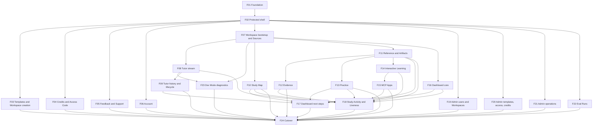

# Folio End-To-End Implementation Plan

Status: proposed ticket breakdown awaiting approval and publication

Date: 2026-06-27

Architecture: [14-folio-production-architecture](./14-folio-production-architecture.md)

Ticket drafts: [16-folio-ticket-drafts](./16-folio-ticket-drafts.md)

## 1. Program Objective

Replace the complete current frontend with one production Folio application. The program is complete only when every route and study surface uses real API-backed data, all existing required behavior is preserved or deliberately superseded, all Legacy/Mist/Next generation code is deleted, and the production verification gates pass.

This is not a CSS reskin and not a prototype port. The TutorBook `feat/ui-preview-themes` Folio implementation is the visual and interaction reference. StudyAgent contracts, persisted state, authorization, and verified runtime outcomes define behavior.

## 2. Release Contract

The Folio release must provide:

- one UI generation with no runtime fallback or theme switcher;
- all public, learner, Notebook Workspace, Admin, Eval, empty, loading, error, degraded, and responsive states;
- a 35% Tutor / 65% Workspace desktop default, a persisted draggable divider, and independent pane scrolling;
- a real Learner Dashboard Summary, due Practice, Dashboard Recommendations, recent activity, and Study time;
- typed and reloadable Dashboard Action Targets;
- working Tutor streaming, Runtime Work View, Tutor Session history/settings/lifecycle, and Artifact consent;
- a real Study Map, Reference Surfaces, Evidence, source opening, Practice, Interactive Learning, and MCP Apps;
- source upload/readiness/retry and honest ingestion state;
- Beta Consent, Published Study Templates, credits, Access Codes, support, account, Admin, and Eval routes;
- WCAG 2.2 AA-oriented keyboard/focus/semantic behavior and verified responsive composition;
- real-data browser proof through Docker, Postgres, object storage, API, worker, and web;
- removal of prototype/mock production data and obsolete frontend dependencies.

## 3. Delivery Model

### Source-control isolation

Create a `feat/folio-production-revamp` integration branch from the agreed implementation base. Every implementation PR targets that branch. Main/production receives one final cutover PR after the complete program passes.

This avoids:

- shipping a half-Folio mixed product;
- keeping a runtime Legacy/Folio switch;
- merging incomplete routes into production simply to keep PRs small.

It does introduce integration-branch drift. Mitigate it by merging main into the integration branch on a regular cadence, keeping slices narrow, and assigning clear ownership of shared router/schema/UI foundations.

### Vertical-slice rule

Except for the program tracker, each issue must deliver a complete user-visible or operator-visible path through all layers it needs:

- shared schema and migration when applicable;
- Fastify validation/read/command behavior;
- typed API client and Query operation;
- Folio route/components and all states;
- unit/component/API/Postgres/browser tests proportionate to the slice;
- accessibility, observability, and responsive acceptance for that surface;
- deletion of the obsolete code replaced by the slice where safe.

Do not create separate “backend,” “frontend,” “styling,” or “tests later” issues for one behavior.

### Real-data rule

Production code must not import Design Lab data, hard-coded learner progress, fabricated recommendations, sample activity, static graph nodes, simulated citations, fake MCP markup, or local-only Practice results.

Tests may use deterministic factories and fixtures, but release-path browser tests must create or seed state through supported database/API/test-fixture paths and then exercise the real application.

### Migration rule

Database/API changes deploy before or with compatible clients:

- additive schema and nullable/defaulted columns first;
- backfill where required;
- dual-readable response evolution only for the duration of the integration branch;
- final removal of obsolete fields/routes at cutover;
- no irreversible destructive migration bundled with the first web deployment.

## 4. Program Slices

| ID  | Title                                                         | Type         | Blocked by                             | Independently verifiable result                                                                                         |
| --- | ------------------------------------------------------------- | ------------ | -------------------------------------- | ----------------------------------------------------------------------------------------------------------------------- |
| F00 | Folio production frontend revamp tracker                      | HITL tracker | None                                   | One dependency-ordered program checklist and decision index                                                             |
| F01 | Public shell and production client foundation                 | AFK          | None                                   | Public/login routes run through Folio, TanStack Router, Query, and validated API client with route splitting            |
| F02 | Protected learner shell and Beta Consent                      | AFK          | F01                                    | Auth, entitlement, disabled-account, consent, analytics-policy, pending/error flows work end to end                     |
| F03 | Published Study Template to Personal Learner Workspace        | AFK          | F02                                    | Learner discovers a template, creates a real Workspace, and enters it                                                   |
| F04 | Tutor Credits and Access Code flows                           | AFK          | F02                                    | Balance, checkout/disabled checkout, redemption, and updated entitlement state work                                     |
| F05 | Learning Feedback and Support Report flows                    | AFK          | F02                                    | Learner submits real feedback/support with validation, success, and failure states                                      |
| F06 | Account resources and deletion requests                       | AFK          | F02                                    | Account reads Workspaces/Sources without N+1 calls and performs confirmed deletion/request flows                        |
| F07 | Notebook Workspace bootstrap and source lifecycle             | AFK          | F02                                    | Real Notebook opens in Folio with source upload/readiness/retry and typed surface bootstrap                             |
| F08 | Tutor conversation stream and Runtime Work View               | HITL         | F07                                    | Real prompt streams, renders grounded response/runtime work, persists, reloads, and resolves transport adapter decision |
| F09 | Tutor Session history, settings, and lifecycle                | AFK          | F08                                    | History/detail/settings plus pause/resume/end and artifact-consent behavior work                                        |
| F10 | Study Map over the Workspace Read Model                       | AFK          | F07                                    | Real graph renders Folio nodes, selection, layout, filters, keyboard/list fallback, and deep links                      |
| F11 | Reference Surfaces and Artifact lifecycle                     | AFK          | F07                                    | Real Reference/Reading/Artifact surfaces render, act, regenerate, and reload                                            |
| F12 | Evidence and source opening                                   | AFK          | F11                                    | Learner-safe grouped Evidence and real page/slide/timestamp/source targets work                                         |
| F13 | Persisted Practice and Mastery Evidence                       | AFK          | F11                                    | Quiz/flashcard/worked-example action persists, evaluates, refreshes learning state, and reloads                         |
| F14 | Interactive Learning Blocks and Actions                       | AFK          | F11                                    | Existing canonical block/action pipeline is rendered in Folio with real durable outcomes                                |
| F15 | Sandboxed MCP App Renderer in Folio                           | AFK          | F14                                    | Real bundles run through bridge/sandbox/fallback with Folio host chrome and persisted actions                           |
| F16 | Learner Dashboard Summary core                                | AFK          | F07                                    | Real Notebook progress, resume, recent activity, empty/not-ready sections and typed CTAs work                           |
| F17 | Due Practice and Dashboard Recommendations                    | AFK          | F09, F10, F11, F13, F16                | Deterministic real queues/recommendations and persisted async enrichment open complete targets                          |
| F18 | Study Activity Intervals and Session Liveness                 | AFK          | F08, F10, F11, F12, F13, F14, F15, F16 | Cross-surface time, 15/30 minute liveness, pause/continue, and dashboard chart work                                     |
| F19 | Admin users and Workspaces                                    | AFK          | F01, F02                               | User/Workspace lists, details, status actions, pagination, and authorization work in dense Folio operator UI            |
| F20 | Admin templates, Access Codes, and credits                    | AFK          | F01, F02                               | Content/access/credit administration works with typed real-data forms and tables                                        |
| F21 | Admin feedback, ingestion, analytics, and deletion operations | AFK          | F01, F02                               | Remaining operational queues, health/actions, summaries, and deletion requests work                                     |
| F22 | Eval Runs console                                             | AFK          | F01, F02                               | Eval list/detail/event stream works through typed lazy Folio operator routes                                            |
| F23 | Dev Mode diagnostics                                          | AFK          | F07, F08                               | Developer timeline, Tutor/graph/source/MCP diagnostics remain available without learner leakage                         |
| F24 | Production cutover and Legacy deletion                        | HITL         | F03-F23                                | Full browser/accessibility/visual/performance gates pass and obsolete frontend is deleted                               |

## 5. Dependency Graph

## 6. Delivery Waves

### Wave A: foundation and access

Tickets: F01-F02.

Exit criteria:

- TanStack Router file routes and generated tree are authoritative;
- `@studyagent/api-client` is the only new-code HTTP boundary;
- Query client defaults, error envelope, correlation capture, route loading/errors, Folio tokens/fonts, and route splitting exist;
- public/login/auth/consent flows work against real auth APIs;
- direct-fetch and bundle-budget enforcement is introduced for migrated code.

### Wave B: hosted-beta product shell

Tickets: F03-F06 and F19-F22; parallel after F02. F23 follows the first real Workspace/Tutor vertical slices.

Exit criteria:

- every non-Workspace route is assigned a complete Folio implementation;
- Published Study Template creation, credits, Access Codes, support, account, Admin, and Eval run on real APIs;
- account N+1 source loading is replaced with one bounded projection;
- Admin/Dev remain operator-first and cannot leak into learner presentation.

### Wave C: Notebook Workspace spine

Tickets: F07-F11; F08 requires live human review.

Exit criteria:

- Workspace Bootstrap and typed URL state are authoritative;
- 35/65 split, persisted divider, independent scroll, source readiness/upload/retry, and surface switching work;
- real Tutor stream and Study Map run in Folio;
- Reference Surfaces and Artifacts have complete Folio states;
- transport adapter decision is recorded from real-stream evidence.

### Wave D: grounded study interactions

Tickets: F12-F15.

Exit criteria:

- Evidence opens real source targets;
- Practice persists attempts and Mastery Evidence;
- Interactive Learning and MCP App paths use existing canonical contracts and real action persistence;
- reload reconstructs all durable state from StudyAgent, never iframe/local mock state.

### Wave E: dashboard intelligence and time

Tickets: F16-F18.

Exit criteria:

- dashboard core and next-step sections are API-owned real projections;
- every CTA opens a completed Workspace target;
- recommendations are deterministic, with optional persisted asynchronous LLM enrichment;
- Study Activity Intervals aggregate all completed surfaces;
- Session Liveness implements 15/30-minute behavior and emits correct lifecycle events.

### Wave F: production cutover

Ticket: F24.

Exit criteria:

- complete route/surface matrix passes;
- visual comparison, keyboard/manual accessibility, automated axe, responsive, Docker, Postgres, and provider-path checks pass;
- bundle budgets and production observability pass;
- old components, CSS, fonts, router, fetch helpers, theme switcher, UI generations, and unused dependencies are deleted;
- one deployable Folio artifact remains.

## 7. Route Coverage Matrix

| Route/surface                                                                                  | Owning ticket(s) | Required states                                                                         |
| ---------------------------------------------------------------------------------------------- | ---------------- | --------------------------------------------------------------------------------------- |
| `/`, `/demo`, `/contact`, `/privacy`, `/terms`                                                 | F01              | default, responsive, not-found, public API/analytics degradation where relevant         |
| `/login`, `/auth/callback`                                                                     | F01, F02         | local/WorkOS, pending, failure, redirect, already authenticated                         |
| `/app/consent`                                                                                 | F02              | current, accepted, stale version, failure, disabled account                             |
| `/app/templates/:templateId`, `/app/workspaces/new`, `/notebooks`                              | F03              | loading, empty, unavailable, create pending/success/failure                             |
| `/app/credits`, `/app/access-code`                                                             | F04              | balance, exhausted, checkout enabled/disabled, redirect, redemption success/failure     |
| `/app/support`                                                                                 | F05              | form validation, attachment/metadata policy, submit pending/success/failure             |
| `/app/account`                                                                                 | F06              | Workspaces/Sources loading/empty, delete confirm, partial failure, deletion request     |
| `/app` dashboard                                                                               | F16-F18          | loading, partial, empty, not-ready, stale enrichment, activity unavailable, error       |
| `/notebooks/:notebookId` shell/Sources                                                         | F07              | loading, not owned, no source, processing, ready, failed/retry, degraded                |
| Tutor                                                                                          | F08-F09          | empty, streaming, complete, error, retry, disconnected, history, settings, paused/ended |
| Study Map                                                                                      | F10              | loading, empty, refreshing, selected/current/completed/locked, keyboard/list fallback   |
| Reading/Reference/Artifact                                                                     | F11              | all block kinds, proposed/ready/failed, regenerate, primary action, math/code overflow  |
| Evidence/source viewer                                                                         | F12              | grouped, empty, failed, locator variants, source unavailable                            |
| Practice                                                                                       | F13              | unanswered, selected, submitting, correct/incorrect, next, complete, reload             |
| Interactive                                                                                    | F14              | loading, active, saving, completed, invalid action, fallback                            |
| App/MCP                                                                                        | F15              | loading, ready, action, sandbox error, version mismatch, native fallback                |
| `/admin/users*`, `/admin/workspaces*`                                                          | F19              | list/detail/search/pagination/status/action/loading/error/empty                         |
| `/admin/templates`, `/admin/access-codes`, `/admin/credits`                                    | F20              | list/form/action/validation/loading/error/empty                                         |
| `/admin`, `/admin/feedback`, `/admin/ingestion`, `/admin/analytics`, `/admin/account-deletion` | F21              | summary/queue/filter/action/loading/error/empty                                         |
| `/eval-runs/*`                                                                                 | F22              | stream connected/disconnected, list/detail, retry/direct URL                            |
| Notebook Dev Mode and diagnostics                                                              | F23              | developer timeline, Tutor/graph/source/MCP diagnostics hidden from learner              |

## 8. API And Persistence Work By Slice

| Ticket | Primary API/persistence change                                                              |
| ------ | ------------------------------------------------------------------------------------------- |
| F01    | Shared error/route schemas, Fastify schema pattern, API client, derived OpenAPI artifact    |
| F02    | Normalized session/entitlement/consent contracts and policy-safe monitoring bootstrap       |
| F03    | Published Study Template and Personal Learner Workspace creation contract hardening         |
| F04    | Credits, checkout, redemption response/error normalization                                  |
| F05    | Learning Feedback/Support validation and learner-safe status                                |
| F06    | Account Resource Summary to remove browser N+1; deletion command normalization              |
| F07    | Notebook Workspace Bootstrap, source-readiness projection, typed surface/action validation  |
| F08    | Typed Tutor stream event contract and durable reload proof                                  |
| F09    | Cursor-paginated Tutor Session history/detail and lifecycle correctness                     |
| F10    | Workspace Read Model/graph contract completion and layout command validation                |
| F11    | Reference Surface/Artifact contract coverage for every renderer state                       |
| F12    | Evidence grouping and typed source-open targets                                             |
| F13    | Canonical Practice action/attempt/Mastery Evidence flow                                     |
| F14    | Existing Interactive Learning Action and state contract integration                         |
| F15    | Existing bundle manifest/bridge compatibility and failure reporting                         |
| F16    | Learner Dashboard Summary core projection                                                   |
| F17    | Due Practice, deterministic Dashboard Recommendations, persisted enrichment/refresh         |
| F18    | Study Activity Interval schema/table/routes/aggregation and Tutor Turn Disposition/liveness |
| F19    | Admin user/Workspace pagination, detail, and action normalization                           |
| F20    | Admin template/Access Code/credit form and table contract normalization                     |
| F21    | Admin feedback/ingestion/analytics/deletion queue and action normalization                  |
| F22    | Eval Runs pagination/stream/error normalization                                             |
| F23    | Developer timeline and diagnostic projection/stream normalization                           |

## 9. Per-Slice Definition Of Done

Every AFK issue is ready to merge into the Folio integration branch only when:

- shared/domain terminology matches context docs;
- API accepts only validated inputs and returns a validated response/error contract;
- authorization and Notebook ownership are tested server-side;
- persisted paths have PostgreSQL integration coverage;
- frontend uses the shared API client and canonical Query factory;
- no production mock/sample path exists;
- Folio default, loading, empty, error, retry, disabled, and responsive states required by the slice exist;
- keyboard/focus/semantic behavior is covered;
- learner mode hides raw IDs/claims/traces/internal statuses;
- errors preserve learner work and expose a valid recovery path;
- monitoring uses operation names and correlation IDs without private content;
- unit/API/component/browser tests pass;
- replaced obsolete code is deleted where no remaining slice consumes it;
- docs and route/capability matrix are updated.

## 10. Visual Review Protocol

For every Folio learner surface:

1. create the real-data state required by the reference;
2. capture the implementation at the same viewport as the reference;
3. combine reference and implementation for one comparison;
4. inspect typography, spacing, hierarchy, border/radius, color, scroll, focus, clipping, and state;
5. fix material mismatch;
6. repeat at 390, 768, 1024/1280, and 1440 where applicable;
7. verify actual interactions separately; screenshots do not prove behavior.

Missing Folio frames are designed in the established token/primitive language within the owning slice. They cannot fall back to generic shadcn or Legacy presentation.

## 11. Production Verification Matrix

| Gate          | Required proof                                                              |
| ------------- | --------------------------------------------------------------------------- |
| Contracts     | Shared schema tests and API response validation                             |
| Database      | `RUN_POSTGRES_INTEGRATION=1` coverage for new persisted paths               |
| Build         | root check/build/test and package-local web tests                           |
| Docker        | API, worker, web, database, object storage, queue/event flow healthy        |
| Browser       | critical journeys against real services and persisted data                  |
| Provider      | real tutor provider success separated from fallback-only success            |
| Accessibility | axe plus manual keyboard/focus/zoom/reduced-motion checks                   |
| Visual        | same-state/same-viewport Folio comparison                                   |
| Responsive    | 390, 768, 1024, 1280, 1440 viewports                                        |
| Performance   | route chunks and Core Web Vitals within ADR-0029 budgets                    |
| Security      | route/API authorization, CSRF posture, redirect allowlists, iframe sandbox  |
| Observability | route/API/tutor/event/MCP failures visible with correlation                 |
| Deletion      | no Legacy/Mist/Next runtime import, CSS, route, theme, or mock data remains |

## 12. Risks And Controls

| Risk                                          | Control                                                                           |
| --------------------------------------------- | --------------------------------------------------------------------------------- |
| Integration branch diverges from main         | Scheduled main merges, small slices, explicit shared-boundary ownership           |
| Visual port accidentally copies mock behavior | Contract-first acceptance and real-data browser tests                             |
| New read model becomes a mega endpoint        | Bounded bootstrap rules and independent graph/reference/history resources         |
| UI calls multiply into waterfalls             | Route prefetch with shared Query factories and parallel child queries             |
| TanStack AI beta churn                        | StudyAgent-owned adapter and F08 real-stream decision gate                        |
| Study Activity overcounts open-tab time       | Semantic pulse eligibility, visibility policy, server cap, ADR-0028 tests         |
| Folio typography bloats assets                | Required subsets only and route/bundle budgets                                    |
| Admin work delays learner product             | Parallel F19 after foundation; operator-first styling avoids editorial overdesign |
| Accessibility deferred to cutover             | Per-slice Definition of Done plus final manual gate                               |
| Legacy deletion breaks hidden capability      | Capability matrix and F21 deletion audit against API/events/tests                 |

## 13. Publication Plan

After the user approves the issue granularity and dependencies:

1. create F00 as the parent GitHub issue;
2. publish F01-F24 in dependency order so blocker references use real issue numbers;
3. add `ready-for-agent` to AFK tickets;
4. mark F08 and F24 as HITL in their bodies; the repository currently lacks the documented `ready-for-human` GitHub label, so either create that label with maintainer approval or leave those tickets without the AFK label;
5. update this plan and [16-folio-ticket-drafts](./16-folio-ticket-drafts.md) with GitHub links;
6. do not modify or close unrelated existing issues.
